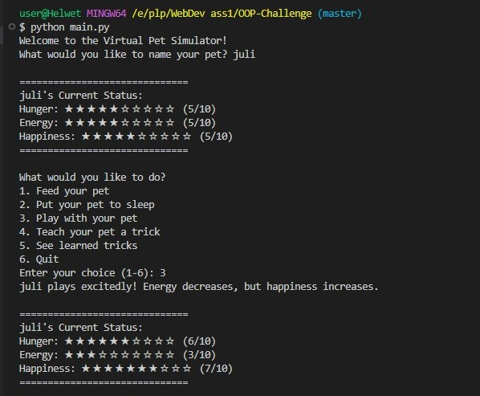

# OOP-Challenge (Group 400 Solution)
# 🐾 Virtual Pet Simulator

A Python-based virtual pet game that demonstrates object-oriented programming principles with an interactive command-line interface.

 


## 🛠️ Technologies Used
- Python 3.8+
- Object-Oriented Programming (OOP)
- Command-line interface

## 📁 Project Structure
 virtual-pet/
├── pet.py # Contains the Pet class implementation
├── main.py # Main interactive program
└── README.md # This documentation file

Copy

## 🚀 How to Run
1. **Prerequisites**:
   - Python 3.8 or later installed
   - VS Code (recommended) or any Python IDE

2. **Running the program**:
   ```bash
   # Clone the repository 
   git clone [https://github.com/yourusername/virtual-pet.git](https://github.com/charlesricha/OOP-Challenge.git)
   cd virtual-pet

   # Run the program
   python main.py
   
## 🎮 Features
1. Create and name your virtual pet

2. Interactive menu system:

3. Feed your pet (eat())

4. Put your pet to sleep (sleep())

5. Play with your pet (play())

7. Teach new tricks (train())

8. View learned tricks (show_tricks())

9. Visual status indicators

10. Persistent trick memory

## 💡 Learning Objectives

This project demonstrates:

- Python class implementation
- Object attributes and methods
- User input handling
- Basic game loop structure
- State management

## 📝 Code Overview
# pet.py
  - Contains the Pet class with:
      -Core attributes: name, hunger, energy, happiness, tricks
      -Methods: eat(), sleep(), play(), train(), show_tricks(), get_status()

# main.py
   Implements:
     - Interactive command loop
     - User input handling
     - Menu display

## 🛠️ Future Enhancements

Add graphical interface (Tkinter/PyGame)

Implement save/load functionality

Add pet aging and evolution

Create achievement system

## 🤝 How to Contribute

Fork the project

Create your feature branch (git checkout -b feature/AmazingFeature)

Commit your changes (git commit -m 'Add some amazing feature')

Push to the branch (git push origin feature/AmazingFeature)

Open a Pull Request

📜 License
This project is licensed under the MIT License - see the LICENSE file for details.

Created with ❤️ by [Charles] - Feel free to connect!
📧 Email: charlesmuthui2006@gmail.com
🌐 Portfolio: yourportfolio.com

Copy

### How to Use This README:
1. Create a new file named `README.md` in your project folder
2. Paste this entire content


